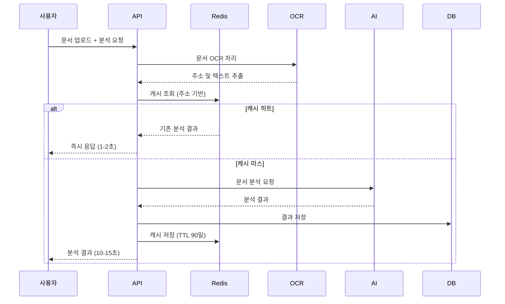

# Estate Server - 부동산 등기부등본 분석 서비스

NestJS 기반의 부동산 등기부등본 AI 분석 서비스입니다. OCR로 문서를 인식하고 AI가 법적 위험도를 분석하여 안전한 부동산 거래를 지원합니다.

## 📋 목차

- [프로젝트 개요](#-프로젝트-개요)
- [핵심 비즈니스 플로우](#-핵심-비즈니스-플로우)
- [기술 스택](#-기술-스택)
- [프로젝트 구조](#-프로젝트-구조)
- [로컬 실행 방법](#-로컬-실행-방법)
- [API 문서](#-api-문서)
- [문서 가이드](#-문서-가이드)

## 🎯 프로젝트 개요

부동산 거래 시 필수인 등기부등본을 AI가 자동 분석하여 법적 위험 요소를 진단하고, 안전한 계약을 위한 인사이트를 제공하는 서비스입니다.

### 주요 기능

- **문서 OCR 인식**: Clova OCR로 등기부등본 텍스트 추출
- **AI 기반 분석**: Gemini/ChatGPT가 소유권, 근저당권, 가압류 등 위험 요소 분석
- **안전도 점수 산출**: 0-100점 안전도 점수 및 등급(SAFE/CAUTION/DANGER) 제공
- **맞춤형 계약 조항 추천**: 분석 결과 기반 필수 계약 조항 제시
- **전세보증보험 가입 가능 여부 판단**: 보험 가입 적격성 자동 판단
- **Redis 기반 캐싱**: 동일 주소 재분석 시 90% 응답 시간 단축, 토큰 비용 절감

## 🔄 핵심 비즈니스 플로우

### 1. 사용자 인증 (Kakao OAuth)

```
사용자 → 카카오 로그인 요청 → 카카오 인증 → JWT 발급 → 서비스 이용
```

- Passport.js + Kakao OAuth 2.0 전략 패턴
- Access Token (1시간) + Refresh Token (7일) 발급
- Redis 기반 토큰 관리

### 2. 부동산 분석 요청 (메인 플로우)



**주요 분석 항목:**
- 표제부: 건물 구조, 용도, 면적, 토지 권리 비율
- 갑구(소유권): 현재 소유자, 이전 내역, 소유권 제한 사항
- 을구(권리 제한): 근저당권, 가압류, 가등기, 지상권 등

## 🛠 기술 스택

### Backend Framework
- **NestJS 11**: TypeScript 기반 엔터프라이즈급 프레임워크
- **TypeORM 0.3**: PostgreSQL ORM
- **Passport.js**: 인증 (Kakao OAuth, JWT)

### AI & OCR
- **Google Gemini API**: 등기부등본 AI 분석
- **OpenAI GPT**: 대체 AI 프로바이더
- **Naver Clova OCR**: 문서 텍스트 추출

### 인프라 & DevOps
- **PostgreSQL**: 메인 데이터베이스
- **Redis**: 캐싱 및 세션 관리
- **MinIO (S3 호환)**: 문서 파일 저장
- **Docker Compose**: 로컬 개발 환경

### 보안 & 최적화
- **AES-256-GCM**: 민감정보 암호화 (이메일, 주소, 소유자명)
- **Helmet**: HTTP 보안 헤더
- **Throttler**: Rate Limiting (1분 100회)
- **Winston**: 구조화된 로깅 (Daily Rotate)

## 📂 프로젝트 구조

```
src/
├── app.module.ts                    # 애플리케이션 루트 모듈
├── main.ts                          # 엔트리 포인트
├── config/                          # 환경설정
│   ├── typeorm.config.ts           # DB 설정
│   ├── redis.config.ts             # Redis 설정
│   ├── encryption.config.ts        # 암호화 설정
│   └── env.validation.ts           # 환경변수 검증
├── common/                          # 공통 모듈
│   ├── filters/                    # 전역 예외 필터
│   ├── interceptors/               # HTTP 인터셉터
│   ├── middleware/                 # 로깅 미들웨어
│   ├── pipes/                      # Validation 파이프
│   ├── utils/                      # 유틸리티 (암호화, 주소 정규화 등)
│   └── ports/                      # Repository 인터페이스
└── modules/                         # 기능 모듈
    ├── auth/                       # 인증 (Kakao OAuth, JWT)
    │   ├── controllers/
    │   ├── services/
    │   ├── strategies/             # Passport 전략
    │   ├── guards/                 # 인증/인가 가드
    │   └── dto/
    ├── user/                       # 사용자 관리
    ├── estate/                     # 부동산 정보
    ├── estate-analysis-report/     # 분석 리포트 (메인 비즈니스)
    │   ├── services/
    │   │   ├── estate-analysis-report.service.ts
    │   │   ├── estate-analysis-report-cache.service.ts
    │   │   ├── address-based-cache-strategy.service.ts
    │   │   └── document-processing.service.ts
    │   ├── ports/                  # 전략 패턴 인터페이스
    │   ├── prompts/                # AI 프롬프트
    │   └── repositories/
    ├── document/                   # 문서 업로드/관리
    ├── term/                       # 이용약관
    ├── ai-provider/                # AI 연동 (Gemini/ChatGPT)
    ├── ocr/                        # OCR 처리
    ├── s3/                         # 파일 저장소
    └── redis/                      # 캐시 관리
```

### 계층형 아키텍처 (Layered Architecture)

모든 비즈니스 모듈은 다음 계층으로 구성됩니다:

- **Controller**: HTTP 요청 처리, DTO 검증
- **Service**: 비즈니스 로직, 트랜잭션 관리
- **Repository**: 데이터베이스 접근
- **Entity**: 데이터 모델 (TypeORM)
- **DTO**: 요청/응답 데이터 전송 객체

## 🚀 로컬 실행 방법

### 1. 사전 요구사항

- Node.js 22.x
- Docker & Docker Compose
- PostgreSQL 16.x (또는 Docker로 실행)

### 2. 패키지 설치

```bash
npm install
```

### 3. 환경 변수 설정

프로젝트 루트에 `.env` 파일 생성:

```env
# Database
DB_HOST=localhost
DB_PORT=54322
DB_USERNAME=postgres
DB_PASSWORD=postgres
DB_DATABASE=webprogramming

# Kakao OAuth
KAKAO_CLIENT_ID=YOUR_KAKAO_CLIENT_ID
KAKAO_CLIENT_SECRET=YOUR_KAKAO_CLIENT_SECRET

# JWT (최소 32자)
JWT_SECRET=your_jwt_secret_minimum_32_characters_required
JWT_REGISTER_SECRET=your_jwt_register_secret_minimum_32_characters
JWT_REFRESH_SECRET=your_jwt_refresh_secret_minimum_32_characters
JWT_ACCESS_TOKEN_EXPIRATION_TIME=1h
JWT_REFRESH_TOKEN_EXPIRATION_TIME=7d
JWT_REFRESH_TOKEN_EXPIRATION_TIME_TTL=604800

# AI Provider ('gemini' 또는 'chatgpt')
AI_PROVIDER=gemini
GEMINI_API_KEY=YOUR_GEMINI_API_KEY
GEMINI_MODEL_NAME=gemini-1.5-flash
# OPENAI_API_KEY=YOUR_OPENAI_API_KEY
# GPT_MODEL_NAME=gpt-4

# AWS S3 (MinIO)
AWS_ACCESS_KEY_ID=minioadmin
AWS_SECRET_ACCESS_KEY=minioadmin
AWS_S3_ENDPOINT=http://localhost:9000
AWS_S3_BUCKET_NAME=documents
AWS_REGION=us-east-1

# Redis
REDIS_HOST=localhost
REDIS_PORT=6379

# Frontend
FRONTEND_URL=http://localhost:3001

# 암호화 키 (최소 32자)
ENCRYPTION_KEY=your_encryption_key_minimum_32_characters_required
ENCRYPTION_ENABLED=true

# Clova OCR (선택)
CLOVA_API_KEY=YOUR_CLOVA_API_KEY
CLOVA_API_GATEWAY=YOUR_CLOVA_API_GATEWAY
```

📖 **환경변수 상세 가이드**: [환경 변수 설정 가이드](./docs/environment-variables.md)

### 4. Docker 인프라 실행

PostgreSQL, Redis, MinIO를 Docker로 실행:

```bash
npm run docker:up
```

### 5. 애플리케이션 실행

```bash
# 개발 모드 (Hot Reload)
npm run start:dev

# 프로덕션 빌드
npm run build
npm run start:prod
```

서버는 `http://localhost:3000`에서 실행됩니다.

## 📚 API 문서

### Swagger UI

애플리케이션 실행 후 `http://localhost:3000/api`에서 대화형 API 문서를 확인할 수 있습니다.

### 주요 엔드포인트

#### 인증 (Auth)
- `GET /auth/kakao` - 카카오 로그인 시작
- `GET /auth/kakao/callback` - 카카오 로그인 콜백
- `POST /auth/refresh` - Access Token 갱신
- `POST /auth/logout` - 로그아웃

#### 부동산 분석 (Estate Analysis)
- `POST /estate-analysis` - 등기부등본 분석 요청 (JWT 필요)
- `GET /estate-analysis/:estateId` - 분석 결과 조회
- `GET /estate-analysis` - 분석 결과 목록 (페이지네이션, 필터링)

#### 문서 관리 (Document)
- `POST /documents` - 문서 업로드 (JWT 필요)
- `GET /documents` - 업로드한 문서 목록
- `DELETE /documents/:id` - 문서 삭제

#### 사용자 (User)
- `GET /users` - 사용자 목록 (관리자 전용)
- `GET /users/:id` - 사용자 상세 조회
- `PUT /users/:id` - 사용자 정보 수정
- `DELETE /users/:id` - 사용자 삭제

#### 이용약관 (Term)
- `GET /terms` - 이용약관 조회
- `POST /terms` - 이용약관 생성 (관리자 전용)

#### 헬스 체크
- `GET /health` - 서버 상태 확인

## 📖 문서 가이드

### 아키텍처 & 설계
- [프로젝트 아키텍처 개요](./docs/project-architecture.md) - 계층형 아키텍처, 전략 패턴, 헥사고날 아키텍처
- [Passport와 전략 패턴](./docs/passport-and-strategy-pattern.md) - 인증 전략 패턴 설명
- [인증 플로우](./docs/authentication-flow.md) - 카카오 OAuth + JWT 인증 흐름도

### 보안 & 성능
- [데이터 암호화 가이드](./docs/data-encryption-guide.md) - AES-256-GCM 암호화 구현 상세
- [암호화 구현 요약](./docs/encryption-implementation-summary.md) - 암호화 적용 대상 및 사용법
- [서버 하드닝](./docs/server-hardening.md) - 보안, 안정성, 성능 최적화 조치
- [Estate Analysis 최적화](./docs/estate-analysis-optimization.md) - Redis 캐싱으로 토큰 70-90% 절감

### 운영 & 테스트
- [환경 변수 설정 가이드](./docs/environment-variables.md) - 필수/선택 환경변수 및 검증 규칙
- [API 테스트 케이스](./docs/estate-analysis-report-api-test-cases.md) - 부동산 분석 API 테스트 시나리오

## 🔒 보안 기능

### 데이터 암호화
- **암호화 대상**: 이메일, 사용자명, 주소, 소유자명
- **알고리즘**: AES-256-GCM
- **특징**: 자동 암호화/복호화 (TypeORM ValueTransformer)

### 인증 & 인가
- **OAuth 2.0**: 카카오 로그인
- **JWT**: Access Token (1h) + Refresh Token (7d)
- **Role-Based Access Control**: 사용자/관리자 권한 분리

### 보안 미들웨어
- **Helmet**: HTTP 보안 헤더 (CSP, HSTS, X-Frame-Options 등)
- **Throttler**: Rate Limiting (1분 100회)
- **CORS**: 허용된 도메인만 접근
- **Sanitization**: XSS 방어 (HTML 태그 제거)

## ⚡ 성능 최적화

### Redis 캐싱 전략
- **주소 기반 캐싱**: 동일 주소 재분석 시 캐시 사용
- **응답 시간**: 10-15초 → 1-2초 (85-90% 단축)
- **토큰 절감**: 중복 요청 시 AI 호출 생략 (50-90% 절감)
- **TTL**: 90일 자동 만료

### DB 최적화
- **Connection Pool**: TypeORM 연결 풀
- **N+1 방지**: Relations 옵션 활용
- **인덱싱**: 자주 조회되는 필드에 인덱스 적용

## 🧪 코드 품질

```bash
# Lint 검사
npm run lint

# 코드 포맷팅
npm run format
```

## 🐳 Docker 관리

```bash
# 인프라 시작 (PostgreSQL, Redis, MinIO)
npm run docker:up

# 인프라 중지
docker-compose down

# 볼륨 포함 완전 삭제
docker-compose down -v
```
