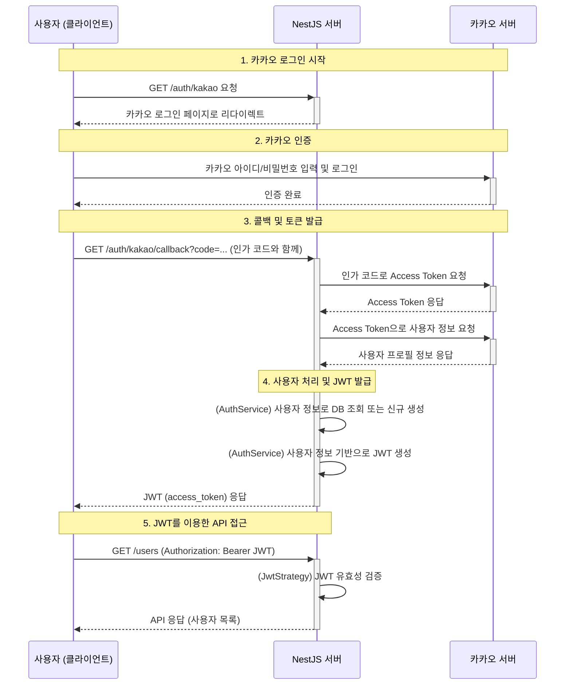

# 카카오 로그인 및 JWT 인증 흐름

## 다이어그램

## 다이어그램 설명

1.  **로그인 시작:** 사용자가 서버의 카카오 로그인 API를 호출하면, 서버는 사용자를 카카오 로그인 페이지로 보냅니다.
2.  **카카오 인증:** 사용자는 카카오 계정으로 로그인하고, 성공 시 카카오는 사용자를 다시 서버의 콜백(callback) URL로 보냅니다. 이때 **인가 코드**가 함께 전달됩니다.
3.  **토큰 발급:** 서버는 받은 인가 코드를 카카오 서버에 보내 **Access Token**으로 교환하고, 이 토큰으로 다시 사용자 정보를 조회합니다.
4.  **JWT 발급:** 서버는 조회한 사용자 정보를 바탕으로, 우리 서비스의 데이터베이스에 해당 사용자가 있는지 확인하거나 새로 생성합니다. 그 후, 이 사용자를 위한 **JWT**를 발급하여 클라이언트(사용자)에게 전달합니다.
5.  **API 접근:** 사용자는 발급받은 JWT를 HTTP 요청의 `Authorization` 헤더에 담아, 인증이 필요한 API(예: `/users`)를 호출하고 성공적으로 데이터를 응답받습니다.
