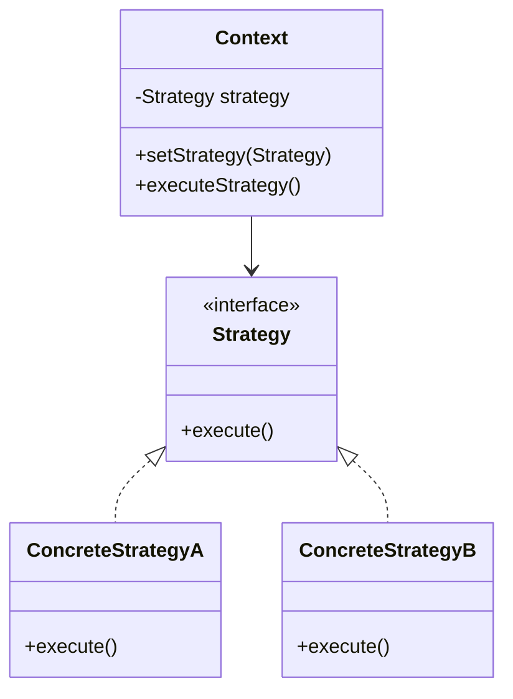
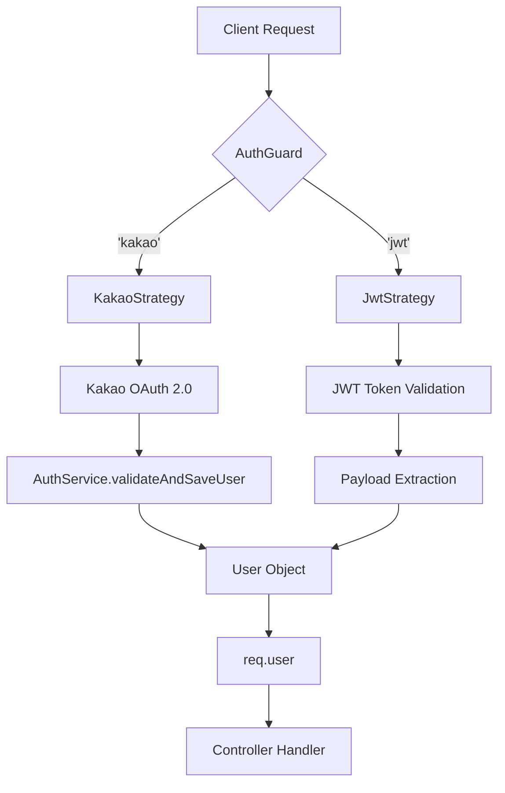

# Passport.js와 전략 패턴 in NestJS

## 개요

Estate Server의 인증 시스템은 Passport.js와 전략 패턴을 활용하여 구현되었습니다. 이 문서는 전략 패턴의 개념과 Passport.js를 통한 구현 방법, 그리고 프로젝트에서의 실제 동작 방식을 설명합니다.

## 1. 전략 패턴 (Strategy Pattern)이란?

전략 패턴은 객체 지향 디자인 패턴 중 하나로, **특정 계열의 알고리즘들을 정의하고 각 알고리즘을 캡슐화하여 이들을 상호 교체 가능하게 만드는 패턴**입니다.

### 전략 패턴의 장점

1. **알고리즘의 독립성**: 각 전략은 독립적으로 구현되어 서로 영향을 주지 않음
2. **런타임 교체**: 실행 중에 전략을 동적으로 변경 가능
3. **확장성**: 새로운 전략 추가 시 기존 코드 수정 불필요
4. **테스트 용이성**: 각 전략을 독립적으로 테스트 가능

### 전략 패턴 구조



**쉬운 비유**: 
서울에서 부산 가는 방법(전략)이 여러 가지(KTX, 비행기, 자동차, 버스) 있을 때, 상황에 따라 최적의 교통수단을 선택하는 것과 같습니다.

## 2. Passport.js: 인증을 위한 전략 패턴의 구현체

Passport.js는 Node.js를 위한 인증 미들웨어로, NestJS에서 널리 사용됩니다. Passport.js의 핵심은 **전략(Strategy)** 입니다.

### Passport.js의 특징

- **다양한 인증 전략**: 500개 이상의 인증 전략 플러그인 제공
- **모듈성**: 필요한 전략만 설치하여 사용
- **유연성**: 새로운 인증 방식을 쉽게 추가 가능
- **NestJS 통합**: `@nestjs/passport` 패키지로 완벽한 통합

### Estate Server에서 사용 중인 전략

1. **Kakao Strategy**: 카카오 OAuth 2.0 소셜 로그인
2. **JWT Strategy**: JWT 토큰 기반 인증

## 3. 프로젝트 내 인증 흐름

### 전체 인증 아키텍처



### 단계별 동작 방식

#### 단계 1: `@UseGuards` 데코레이터로 인증 시작

컨트롤러의 특정 엔드포인트에 `@UseGuards(AuthGuard('...'))` 데코레이터를 사용하여 인증을 시작합니다. `AuthGuard`에 전달되는 문자열 인자(`'kakao'`, `'jwt'`)가 바로 사용할 **전략의 이름**입니다.

**예시: `src/modules/auth/controllers/auth.controller.ts`**

```typescript
@Controller('auth')
export class AuthController {
  constructor(private readonly authService: AuthService) {}

  @Get('kakao')
  @UseGuards(KakaoAuthGuard) // 'kakao' 전략 사용
  @ApiOperation({ summary: '카카오 로그인 시작' })
  kakaoLogin() {
    // 이 메서드는 실제로 실행되지 않음
    // KakaoStrategy가 자동으로 카카오 로그인 페이지로 리다이렉트
  }

  @Get('kakao/callback')
  @UseGuards(KakaoAuthGuard) // 카카오 로그인 후 콜백 처리
  @ApiOperation({ summary: '카카오 로그인 콜백' })
  async kakaoLoginCallback(
    @Req() req: RequestWithUser,
    @Res() res: Response
  ) {
    // req.user에 KakaoStrategy의 validate() 반환값이 주입됨
    const { user } = req;
    const token = await this.authService.login(user);
    
    // 프론트엔드로 토큰 전달
    return res.redirect(
      `${process.env.FRONTEND_URL}?token=${token.access_token}`
    );
  }

  @Get('profile')
  @UseGuards(JwtAuthGuard) // 'jwt' 전략 사용
  @ApiOperation({ summary: '내 프로필 조회' })
  getProfile(@GetUser() user: User) {
    // req.user에 JwtStrategy의 validate() 반환값이 주입됨
    return user;
  }
}
```

#### 단계 2: 전략(Strategy)의 `validate` 메소드 실행

`AuthGuard`는 지정된 이름의 전략을 찾아 해당 전략의 `validate` 메소드를 실행합니다.

##### Kakao Strategy

**파일**: `src/modules/auth/strategies/kakao.strategy.ts`

```typescript
@Injectable()
export class KakaoStrategy extends PassportStrategy(Strategy, 'kakao') {
  constructor(
    private readonly authService: AuthService,
    private readonly configService: ConfigService,
  ) {
    super({
      clientID: configService.get<string>('KAKAO_CLIENT_ID'),
      clientSecret: configService.get<string>('KAKAO_CLIENT_SECRET'),
      callbackURL: '/auth/kakao/callback',
      scope: ['profile_nickname', 'account_email'],
    });
  }

  /**
   * 카카오 인증 성공 후 자동 호출되는 메서드
   * @param accessToken 카카오 Access Token
   * @param refreshToken 카카오 Refresh Token
   * @param profile 카카오 사용자 프로필
   */
  async validate(
    accessToken: string,
    refreshToken: string,
    profile: any,
  ): Promise<User> {
    const { id, username, _json } = profile;
    const email = _json?.kakao_account?.email;

    // AuthService를 통해 사용자 조회 또는 생성
    const user = await this.authService.validateAndSaveUser(
      ProviderType.KAKAO,
      id.toString(),
      username,
      email,
      accessToken,
      refreshToken,
    );

    // 반환된 user 객체가 req.user에 주입됨
    return user;
  }
}
```

**동작 흐름**:
1. 사용자가 `/auth/kakao` 접근
2. KakaoStrategy가 카카오 로그인 페이지로 리다이렉트
3. 사용자가 카카오에서 로그인
4. 카카오가 `/auth/kakao/callback?code=xxx`로 리다이렉트
5. KakaoStrategy가 `code`로 Access Token 요청
6. KakaoStrategy가 Access Token으로 사용자 정보 요청
7. `validate()` 메서드 자동 호출 (accessToken, refreshToken, profile 전달)
8. `validate()`에서 반환한 `User` 객체가 `req.user`에 주입

##### JWT Strategy

**파일**: `src/modules/auth/strategies/jwt.strategy.ts`

```typescript
@Injectable()
export class JwtStrategy extends PassportStrategy(Strategy, 'jwt') {
  constructor(private readonly configService: ConfigService) {
    super({
      jwtFromRequest: ExtractJwt.fromAuthHeaderAsBearerToken(),
      ignoreExpiration: false,
      secretOrKey: configService.get<string>('JWT_SECRET'),
    });
  }

  /**
   * JWT 검증 성공 후 자동 호출되는 메서드
   * @param payload JWT 복호화된 payload
   */
  async validate(payload: any): Promise<User> {
    // payload에는 login 시에 넣었던 정보가 담겨 있음
    // { sub: userId, username: username, iat: ..., exp: ... }
    return {
      userId: payload.sub,
      username: payload.username,
      role: payload.role,
    };
  }
}
```

**동작 흐름**:
1. 클라이언트가 `Authorization: Bearer {jwt_token}` 헤더와 함께 요청
2. JwtStrategy가 헤더에서 토큰 추출
3. `JWT_SECRET`으로 토큰 서명 검증
4. 토큰 만료 시간 확인
5. 검증 성공 시 `validate()` 메서드 자동 호출 (payload 전달)
6. `validate()`에서 반환한 객체가 `req.user`에 주입

#### 단계 3: 사용자 객체(User Object) 주입

`validate` 메소드가 성공적으로 `user` 객체를 반환하면, Passport는 이 객체를 `Request` 객체에 `user`라는 이름의 프로퍼티로 주입합니다.

```typescript
// Passport가 자동으로 수행
req.user = await strategy.validate(...);
```

#### 단계 4: 컨트롤러에서 인증된 사용자 정보 사용

컨트롤러 메소드에서 `@Req()` 데코레이터를 사용하거나, 커스텀 데코레이터 `@GetUser()`를 사용하여 인증된 사용자 정보를 사용할 수 있습니다.

**커스텀 데코레이터**: `src/modules/auth/decorators/get-user.decorator.ts`

```typescript
export const GetUser = createParamDecorator(
  (data: unknown, ctx: ExecutionContext): User => {
    const request = ctx.switchToHttp().getRequest();
    return request.user;
  },
);
```

**사용 예시**:

```typescript
@Get('profile')
@UseGuards(JwtAuthGuard)
async getProfile(@GetUser() user: User) {
  // user 객체에 인증된 사용자 정보가 담겨 있음
  return {
    userId: user.userId,
    username: user.username,
    role: user.role,
  };
}

@Post('estate-analysis')
@UseGuards(JwtAuthGuard)
async createAnalysis(
  @Body() dto: CreateEstateAnalysisDto,
  @GetUser() user: User,
) {
  // 인증된 사용자만 분석 요청 가능
  return await this.analysisService.analyzeEstate(dto, user.userId);
}
```

## 4. 역할 기반 접근 제어 (RBAC)

JWT 인증에 추가로 역할(Role) 기반 접근 제어를 구현했습니다.

### RolesGuard

**파일**: `src/modules/auth/guards/roles.guard.ts`

```typescript
@Injectable()
export class RolesGuard implements CanActivate {
  constructor(private readonly reflector: Reflector) {}

  canActivate(context: ExecutionContext): boolean {
    // @Roles() 데코레이터에서 필요한 역할 목록 추출
    const requiredRoles = this.reflector.getAllAndOverride<UserRole[]>(
      ROLES_KEY,
      [context.getHandler(), context.getClass()],
    );

    // @Roles()가 없으면 모두 허용
    if (!requiredRoles) {
      return true;
    }

    const { user } = context.switchToHttp().getRequest();
    
    // 사용자의 역할이 필요한 역할 목록에 포함되어 있는지 확인
    return requiredRoles.some((role) => user.role === role);
  }
}
```

### @Roles() 데코레이터

**파일**: `src/modules/auth/decorators/roles.decorator.ts`

```typescript
export const ROLES_KEY = 'roles';

export const Roles = (...roles: UserRole[]) => 
  SetMetadata(ROLES_KEY, roles);
```

### 사용 예시

```typescript
@Controller('users')
export class UserController {
  @Get()
  @UseGuards(JwtAuthGuard, RolesGuard) // Guard 순서 중요
  @Roles(UserRole.ADMIN) // 관리자만 접근 가능
  @ApiOperation({ summary: '모든 사용자 조회 (관리자 전용)' })
  async findAll(): Promise<UserResponseDto[]> {
    return await this.userService.findAll();
  }

  @Get('me')
  @UseGuards(JwtAuthGuard) // JWT 인증만 필요 (모든 인증된 사용자)
  @ApiOperation({ summary: '내 정보 조회' })
  async getMe(@GetUser() user: User): Promise<UserResponseDto> {
    return await this.userService.findById(user.userId);
  }
}
```

## 5. 전략 패턴의 실제 활용 예시

### 새로운 인증 방식 추가하기 (예: Google OAuth)

전략 패턴 덕분에 기존 코드 수정 없이 새로운 인증 방식을 추가할 수 있습니다.

#### 1단계: 패키지 설치

```bash
npm install passport-google-oauth20
npm install -D @types/passport-google-oauth20
```

#### 2단계: Google Strategy 구현

```typescript
// src/modules/auth/strategies/google.strategy.ts
@Injectable()
export class GoogleStrategy extends PassportStrategy(Strategy, 'google') {
  constructor(
    private readonly authService: AuthService,
    private readonly configService: ConfigService,
  ) {
    super({
      clientID: configService.get<string>('GOOGLE_CLIENT_ID'),
      clientSecret: configService.get<string>('GOOGLE_CLIENT_SECRET'),
      callbackURL: '/auth/google/callback',
      scope: ['email', 'profile'],
    });
  }

  async validate(
    accessToken: string,
    refreshToken: string,
    profile: any,
  ): Promise<User> {
    const { id, displayName, emails } = profile;
    const email = emails[0].value;

    const user = await this.authService.validateAndSaveUser(
      ProviderType.GOOGLE,
      id,
      displayName,
      email,
      accessToken,
      refreshToken,
    );

    return user;
  }
}
```

#### 3단계: AuthModule에 등록

```typescript
// src/modules/auth/auth.module.ts
@Module({
  providers: [
    AuthService,
    KakaoStrategy,
    JwtStrategy,
    GoogleStrategy, // 추가
  ],
})
export class AuthModule {}
```

#### 4단계: 컨트롤러에 엔드포인트 추가

```typescript
// src/modules/auth/controllers/auth.controller.ts
@Get('google')
@UseGuards(GoogleAuthGuard)
googleLogin() {}

@Get('google/callback')
@UseGuards(GoogleAuthGuard)
async googleLoginCallback(@Req() req: RequestWithUser, @Res() res: Response) {
  const { user } = req;
  const token = await this.authService.login(user);
  return res.redirect(`${process.env.FRONTEND_URL}?token=${token.access_token}`);
}
```

**결과**: 기존 Kakao, JWT 인증 코드는 전혀 수정하지 않고 Google 인증이 추가되었습니다!

## 6. 전략 패턴의 장점 요약

### 관심사의 분리
- 인증 로직이 각 전략 클래스로 분리되어 컨트롤러와 서비스 로직이 깔끔하게 유지됩니다.

### 확장성
- 구글, 네이버, 페이스북 등 다른 소셜 로그인을 추가하고 싶을 때, 해당 전략만 새로 구현하여 `AuthModule`에 추가하면 되므로 확장이 매우 용이합니다.

### 재사용성
- 한번 만들어진 인증 전략은 여러 엔드포인트에서 `@UseGuards`를 통해 재사용될 수 있습니다.

### 테스트 용이성
- 각 전략을 독립적으로 Mock 객체로 대체하여 단위 테스트 작성이 쉽습니다.

## 7. 코드 구조 요약

```
src/modules/auth/
├── controllers/
│   └── auth.controller.ts           # 인증 엔드포인트
├── services/
│   └── auth.service.ts              # 비즈니스 로직 (사용자 조회/생성, JWT 발급)
├── strategies/
│   ├── kakao.strategy.ts            # Kakao OAuth 전략
│   └── jwt.strategy.ts              # JWT 인증 전략
├── guards/
│   ├── kakao-auth.guard.ts          # Kakao Guard
│   ├── jwt-auth.guard.ts            # JWT Guard
│   └── roles.guard.ts               # 역할 기반 접근 제어 Guard
├── decorators/
│   ├── get-user.decorator.ts        # @GetUser() 데코레이터
│   └── roles.decorator.ts           # @Roles() 데코레이터
└── auth.module.ts                   # Auth 모듈 (의존성 주입 설정)
```

## 8. 결론

Passport.js와 전략 패턴을 사용함으로써 Estate Server는 다음과 같은 이점을 얻습니다:

✅ **관심사의 분리**: 인증 로직이 각 전략 클래스로 분리되어 유지보수 용이  
✅ **확장성**: 새로운 인증 방식 추가가 매우 쉬움  
✅ **재사용성**: 한 번 만든 전략을 여러 엔드포인트에서 재사용 가능  
✅ **테스트 용이성**: 각 전략을 독립적으로 테스트 가능  
✅ **유연성**: 런타임에 인증 방식을 동적으로 선택 가능

이처럼 Passport.js는 전략 패턴을 효과적으로 활용하여 NestJS 애플리케이션에서 유연하고 확장 가능한 인증 시스템을 구축할 수 있도록 돕습니다.

## 참고 자료

- [NestJS Passport 공식 문서](https://docs.nestjs.com/security/authentication)
- [Passport.js 공식 사이트](http://www.passportjs.org/)
- [프로젝트 내부 문서: 인증 플로우](./authentication-flow.md)
- [프로젝트 내부 문서: 프로젝트 아키텍처](./project-architecture.md)

---

**Last Updated**: 2024-12-16  
**Version**: 1.0.0
