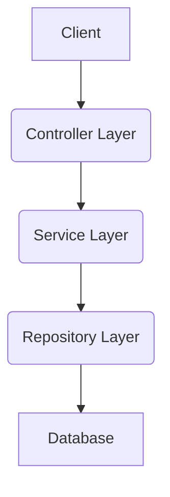
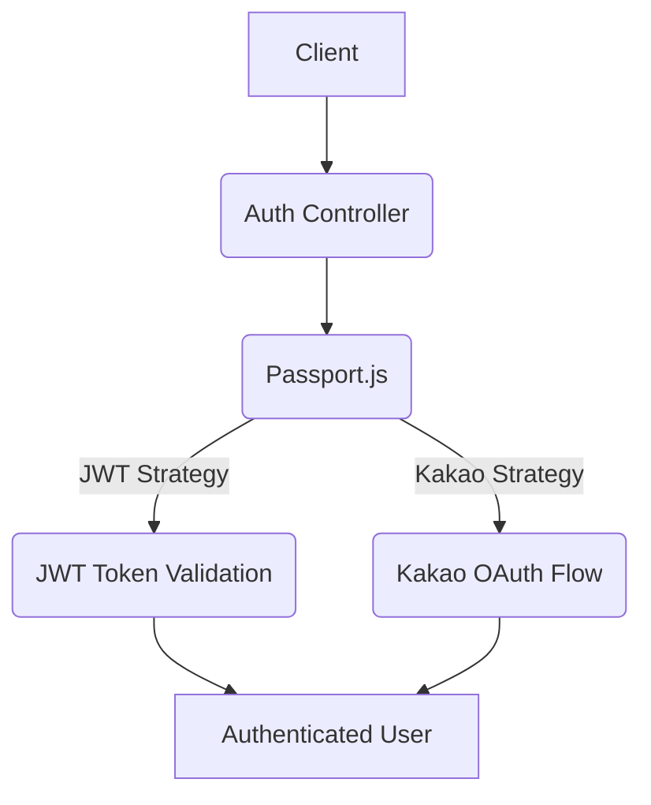
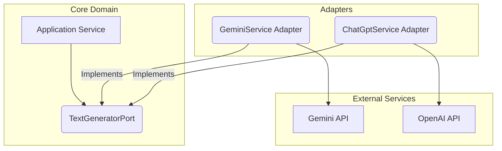

# 프로젝트 아키텍처 개요

이 프로젝트는 효율성과 확장성을 극대화하기 위해 각 모듈의 특성에 맞춰 다양한 아키텍처 스타일을 채택하고 있습니다. 주요 아키텍처는 계층형 아키텍처, 전략 패턴, 헥사고날 아키텍처이며, 이들을 조합하여 유연하고 견고한 시스템을 구축합니다.

---

## 1. 비즈니스 모델: 계층형 아키텍처 (Layered Architecture)

대부분의 비즈니스 로직은 전통적인 계층형 아키텍처를 따릅니다. 이는 관심사의 분리를 명확히 하여 코드의 유지보수성과 테스트 용이성을 높이는 데 중점을 둡니다.

### 계층 구성

*   **Controller Layer**: HTTP 요청을 처리하고 응답을 반환합니다. 주로 요청 유효성 검사 및 서비스 계층 호출을 담당합니다.
*   **Service Layer**: 핵심 비즈니스 로직을 포함합니다. 여러 Repository를 조합하여 복잡한 작업을 수행하며, 트랜잭션 관리를 담당할 수 있습니다.
*   **Repository Layer**: 데이터베이스와의 상호작용을 담당합니다. 엔티티의 CRUD(Create, Read, Update, Delete) 작업을 수행하며, 데이터 접근 로직을 캡슐화합니다.

### Mermaid 다이어그램

---

## 2. 인증: OAuth 2.0 및 전략 패턴 (Strategy Pattern)

인증 시스템은 Passport.js와 OAuth 2.0을 기반으로 하며, 새로운 인증 방식을 유연하게 추가할 수 있도록 전략 패턴을 활용합니다.

### 패턴 설명

*   **Passport.js**: Node.js의 미들웨어로, 다양한 인증 전략을 플러그인 형태로 제공합니다.
*   **OAuth 2.0**: 카카오 로그인과 같은 외부 인증 제공자와의 연동을 위해 사용됩니다.
*   **전략 패턴**: 각 인증 방식(예: JWT, 카카오 OAuth)을 별도의 `Strategy` 클래스로 구현하여, 인증 로직을 캡슐화하고 런타임에 동적으로 변경할 수 있도록 합니다.

### Mermaid 다이어그램

---

## 3. AI 연동: 헥사고날 아키텍처 (Hexagonal Architecture)

Gemini 및 ChatGPT와 같은 AI 모델과의 연동은 헥사고날 아키텍처(Ports and Adapters)를 사용하여 구현됩니다. 이는 코어 도메인 로직을 외부 기술(AI API, 데이터베이스 등)로부터 분리하여 유연성과 테스트 용이성을 극대화합니다.

### 패턴 설명

*   **Ports (포트)**: 코어 도메인과 외부 세계 간의 계약(인터페이스)을 정의합니다. AI 연동의 경우 `TextGeneratorPort`와 같이 AI 모델이 제공해야 하는 기능을 추상화합니다.
*   **Adapters (어댑터)**: 특정 외부 기술(예: Gemini API, OpenAI API)에 대한 포트의 구현체입니다. 코어 도메인은 어댑터의 구체적인 구현을 알 필요 없이 포트를 통해 외부와 통신합니다.
*   **Core Domain**: AI 모델의 구체적인 구현에 의존하지 않고, 순수한 비즈니스 로직만을 포함합니다.

### Mermaid 다이어그램

---

## 결론

이 프로젝트는 각 모듈의 요구사항과 특성에 맞춰 계층형, 전략 패턴, 헥사고날 아키텍처를 유연하게 조합하여 사용합니다. 이러한 하이브리드 접근 방식은 다음과 같은 이점을 제공합니다:

*   **유지보수성**: 각 아키텍처의 장점을 활용하여 코드의 응집도를 높이고 결합도를 낮춥니다.
*   **확장성**: 새로운 비즈니스 요구사항이나 외부 기술(예: 새로운 AI 모델, 다른 인증 방식)을 쉽게 통합할 수 있습니다.
*   **테스트 용이성**: 각 계층 및 도메인 로직을 독립적으로 테스트하기 용이합니다.
