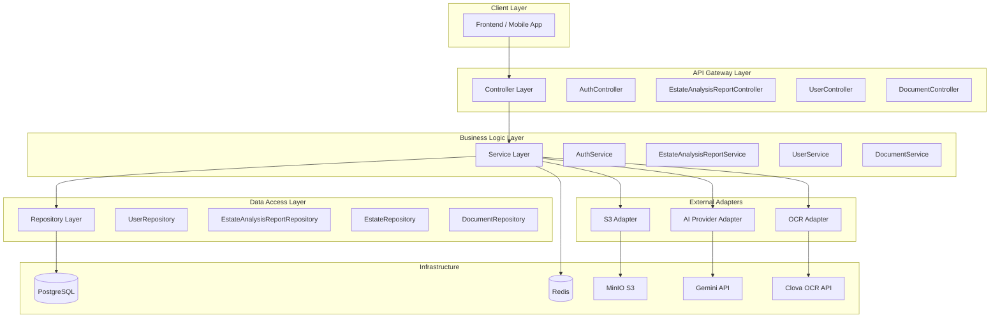
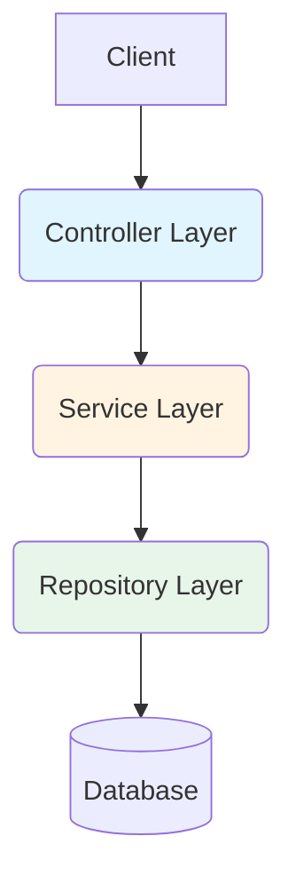
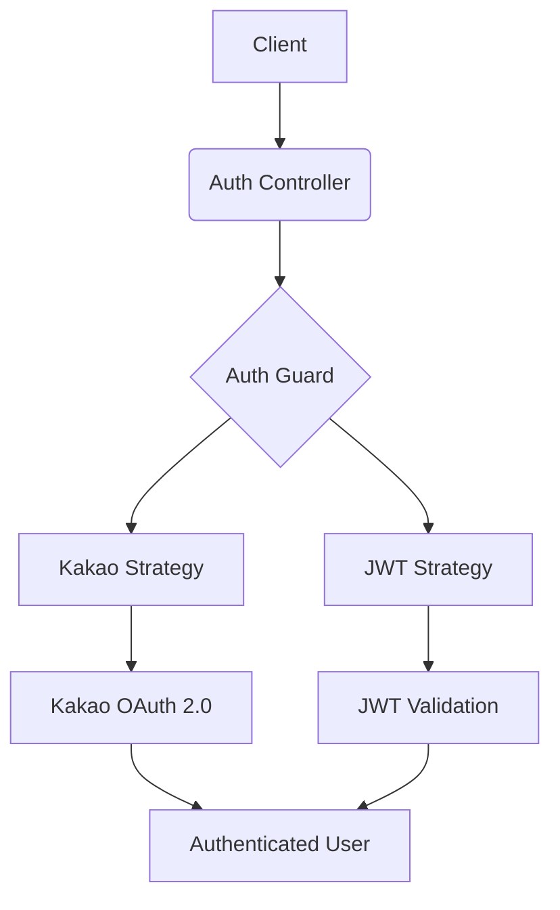
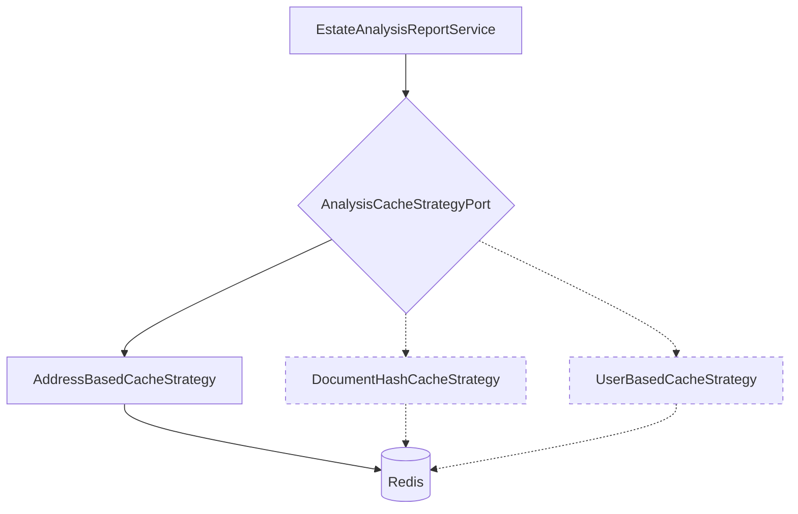
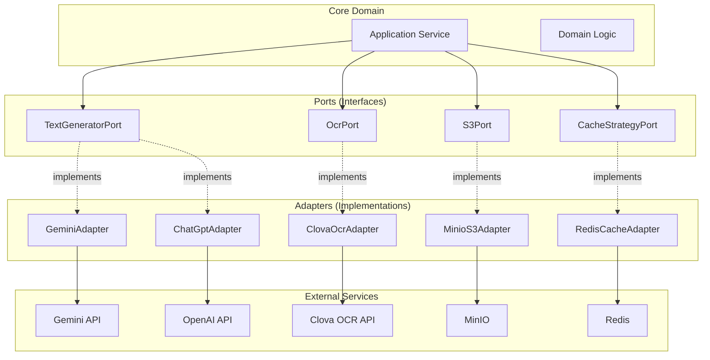
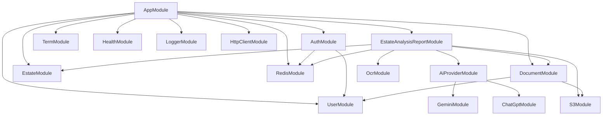

# 프로젝트 아키텍처

## 개요

Estate Server는 부동산 등기부등본 AI 분석 서비스로, NestJS의 모듈 시스템과 의존성 주입을 활용하여 **계층형 아키텍처**, **전략 패턴**, **헥사고날 아키텍처**를 조합한 하이브리드 아키텍처를 채택합니다.

각 모듈의 특성과 요구사항에 맞춰 최적의 아키텍처 패턴을 적용하여, 유지보수성, 확장성, 테스트 용이성을 극대화했습니다.

## 아키텍처 개요도


```mermaid
graph TD
    subgraph "Client Layer"
        A[Frontend / Mobile App]
    end

    subgraph "API Gateway Layer"
        B[Controller Layer]
        B1[AuthController]
        B2[EstateAnalysisReportController]
        B3[UserController]
        B4[DocumentController]
    end

    subgraph "Business Logic Layer"
        C[Service Layer]
        C1[AuthService]
        C2[EstateAnalysisReportService]
        C3[UserService]
        C4[DocumentService]
    end

    subgraph "Data Access Layer"
        D[Repository Layer]
        D1[UserRepository]
        D2[EstateAnalysisReportRepository]
        D3[EstateRepository]
        D4[DocumentRepository]
    end

    subgraph "External Adapters"
        E[AI Provider Adapter]
        F[OCR Adapter]
        G[S3 Adapter]
    end

    subgraph "Infrastructure"
        H[(PostgreSQL)]
        I[(Redis)]
        J[MinIO S3]
        K[Gemini API]
        L[Clova OCR API]
    end

    A --> B
    B --> C
    C --> D
    D --> H
    C --> E
    C --> F
    C --> G
    C --> I
    E --> K
    F --> L
    G --> J
```

## 1. 계층형 아키텍처 (Layered Architecture)

대부분의 비즈니스 모듈은 전통적인 3-Layer 아키텍처를 따릅니다.

### 계층 구성

#### Controller Layer (API Gateway)
- **역할**: HTTP 요청/응답 처리
- **책임**:
  - 요청 데이터 검증 (DTO + ValidationPipe)
  - Service 호출
  - 응답 포맷팅
  - Swagger 문서화
- **제약**: 
  - Entity를 직접 반환하지 않음 (반드시 DTO로 변환)
  - 비즈니스 로직 포함 금지

**예시**: `EstateAnalysisReportController`
```typescript
@Controller('estate-analysis')
@ApiTags('부동산 분석')
export class EstateAnalysisReportController {
  constructor(
    private readonly analysisService: EstateAnalysisReportService
  ) {}

  @Post()
  @UseGuards(JwtAuthGuard)
  @ApiOperation({ summary: '부동산 분석 요청' })
  async createAnalysis(
    @Body() dto: CreateEstateAnalysisDto,
    @GetUser() user: User
  ): Promise<EstateAnalysisReportResponseDto> {
    const result = await this.analysisService.analyzeEstate(dto, user.userId);
    return EstateAnalysisReportMapper.toResponseDto(result);
  }
}
```

#### Service Layer (Business Logic)
- **역할**: 핵심 비즈니스 로직 구현
- **책임**:
  - 여러 Repository 조합
  - 트랜잭션 관리
  - 외부 서비스 호출 (AI, OCR 등)
  - DTO ↔ Entity 변환
  - 에러 처리
- **제약**:
  - Repository 인터페이스만 의존 (구현체 직접 의존 금지)
  - DB 직접 접근 금지

**예시**: `EstateAnalysisReportService`
```typescript
@Injectable()
export class EstateAnalysisReportService {
  constructor(
    @Inject(TEXT_GENERATOR_PORT)
    private readonly aiProvider: TextGeneratorPort,
    @Inject(OCR_PORT)
    private readonly ocrService: OcrPort,
    private readonly reportRepository: EstateAnalysisReportRepository,
    private readonly estateRepository: EstateRepository,
    private readonly cacheService: EstateAnalysisReportCacheService,
  ) {}

  async analyzeEstate(
    dto: CreateEstateAnalysisDto,
    userId: number
  ): Promise<EstateAnalysisReport> {
    // 1. 캐시 조회
    const cached = await this.cacheService.findCachedAnalysis(dto.address, userId);
    if (cached && !dto.forceReAnalyze) {
      return cached;
    }

    // 2. OCR 처리
    const ocrResults = await this.ocrService.processDocuments(dto.documentIds);

    // 3. AI 분석
    const aiResult = await this.aiProvider.generateAnalysis(ocrResults);

    // 4. 저장
    const estate = await this.estateRepository.save(/* ... */);
    const report = await this.reportRepository.save(/* ... */);

    // 5. 캐시 저장
    await this.cacheService.cacheAnalysis(dto.address, report);

    return report;
  }
}
```

#### Repository Layer (Data Access)
- **역할**: 데이터베이스 접근 추상화
- **책임**:
  - Entity CRUD 작업
  - 복잡한 쿼리 작성
  - 트랜잭션 관리 (필요 시)
- **제약**:
  - DTO 사용 금지 (오직 Entity만)
  - 비즈니스 로직 포함 금지

**예시**: `EstateAnalysisReportRepository`
```typescript
@Injectable()
export class EstateAnalysisReportRepository {
  constructor(
    @InjectRepository(EstateAnalysisReport)
    private readonly repository: Repository<EstateAnalysisReport>,
  ) {}

  async findByEstateId(estateId: number): Promise<EstateAnalysisReport | null> {
    return await this.repository.findOne({
      where: { estateId },
      relations: ['estate'],
    });
  }

  async save(report: EstateAnalysisReport): Promise<EstateAnalysisReport> {
    return await this.repository.save(report);
  }

  async findWithPagination(
    page: number,
    limit: number,
    filters: any
  ): Promise<[EstateAnalysisReport[], number]> {
    const queryBuilder = this.repository.createQueryBuilder('report');
    // 복잡한 쿼리 로직...
    return await queryBuilder.getManyAndCount();
  }
}
```

### 계층형 아키텍처 다이어그램


```mermaid
graph TD
    A[Client] --> B(Controller Layer)
    B --> C(Service Layer)
    C --> D(Repository Layer)
    D --> E[(Database)]
    
    style B fill:#e1f5ff
    style C fill:#fff4e1
    style D fill:#e8f5e9
```

## 2. 전략 패턴 (Strategy Pattern)

인증 시스템과 캐싱 전략에 전략 패턴을 적용하여, 런타임에 알고리즘을 동적으로 교체할 수 있도록 설계했습니다.

### 2.1 인증 전략 (Passport.js)

Passport.js를 활용하여 다양한 인증 방식을 플러그인 형태로 구현합니다.


```mermaid
graph TD
    A[Client] --> B(Auth Controller)
    B --> C{Auth Guard}
    C --> D[Kakao Strategy]
    C --> E[JWT Strategy]
    D --> F[Kakao OAuth 2.0]
    E --> G[JWT Validation]
    F --> H[Authenticated User]
    G --> H
```

**구현 예시**:

```typescript
// Kakao Strategy
@Injectable()
export class KakaoStrategy extends PassportStrategy(Strategy, 'kakao') {
  constructor(private readonly authService: AuthService) {
    super({
      clientID: process.env.KAKAO_CLIENT_ID,
      clientSecret: process.env.KAKAO_CLIENT_SECRET,
      callbackURL: '/auth/kakao/callback',
    });
  }

  async validate(
    accessToken: string,
    refreshToken: string,
    profile: any
  ): Promise<User> {
    return await this.authService.validateAndSaveUser(profile);
  }
}

// JWT Strategy
@Injectable()
export class JwtStrategy extends PassportStrategy(Strategy, 'jwt') {
  constructor() {
    super({
      jwtFromRequest: ExtractJwt.fromAuthHeaderAsBearerToken(),
      secretOrKey: process.env.JWT_SECRET,
    });
  }

  async validate(payload: any): Promise<User> {
    return { userId: payload.sub, username: payload.username };
  }
}
```

**사용법**:
```typescript
// Kakao 인증
@Get('kakao')
@UseGuards(KakaoAuthGuard)
kakaoLogin() {}

// JWT 인증
@Get('profile')
@UseGuards(JwtAuthGuard)
getProfile(@GetUser() user: User) {
  return user;
}
```

### 2.2 캐싱 전략

Redis 기반 캐싱에 전략 패턴을 적용하여, 다양한 캐싱 전략을 쉽게 교체할 수 있습니다.


```mermaid
graph TD
    A[EstateAnalysisReportService] --> B{AnalysisCacheStrategyPort}
    B --> C[AddressBasedCacheStrategy]
    B -.-> D[DocumentHashCacheStrategy]
    B -.-> E[UserBasedCacheStrategy]
    
    C --> F[(Redis)]
    D -.-> F
    E -.-> F
    
    style D stroke-dasharray: 5 5
    style E stroke-dasharray: 5 5
```

**Port 정의**:
```typescript
export interface AnalysisCacheStrategyPort {
  findCachedAnalysis(
    address: string,
    userId?: number
  ): Promise<EstateAnalysisReport | null>;
  
  cacheAnalysis(
    address: string,
    report: EstateAnalysisReport
  ): Promise<void>;
  
  getStrategyName(): string;
}
```

**구현체**:
```typescript
@Injectable()
export class AddressBasedCacheStrategyService implements AnalysisCacheStrategyPort {
  constructor(private readonly redis: RedisService) {}

  async findCachedAnalysis(
    address: string,
    userId?: number
  ): Promise<EstateAnalysisReport | null> {
    const normalizedAddress = normalizeAddress(address);
    const key = `estate-analysis:by-address:${normalizedAddress}:${userId}`;
    const estateId = await this.redis.get(key);
    if (!estateId) return null;
    
    return await this.reportRepository.findByEstateId(Number(estateId));
  }

  getStrategyName(): string {
    return 'AddressBasedCache';
  }
}
```

**모듈 등록**:
```typescript
@Module({
  providers: [
    {
      provide: ANALYSIS_CACHE_STRATEGY_PORT,
      useClass: AddressBasedCacheStrategyService, // 전략 교체 시 이 부분만 변경
    },
  ],
})
export class EstateAnalysisReportModule {}
```

## 3. 헥사고날 아키텍처 (Ports & Adapters)

외부 시스템(AI API, OCR API, S3 등)과의 연동에 헥사고날 아키텍처를 적용하여, 코어 도메인 로직을 외부 기술로부터 분리했습니다.

### 아키텍처 다이어그램


```mermaid
graph TD
    subgraph "Core Domain"
        A[Application Service]
        B[Domain Logic]
    end

    subgraph "Ports (Interfaces)"
        C[TextGeneratorPort]
        D[OcrPort]
        E[S3Port]
        F[CacheStrategyPort]
    end

    subgraph "Adapters (Implementations)"
        G[GeminiAdapter]
        H[ChatGptAdapter]
        I[ClovaOcrAdapter]
        J[MinioS3Adapter]
        K[RedisCacheAdapter]
    end

    subgraph "External Services"
        L[Gemini API]
        M[OpenAI API]
        N[Clova OCR API]
        O[MinIO]
        P[Redis]
    end

    A --> C
    A --> D
    A --> E
    A --> F
    
    C -.implements.-> G
    C -.implements.-> H
    D -.implements.-> I
    E -.implements.-> J
    F -.implements.-> K
    
    G --> L
    H --> M
    I --> N
    J --> O
    K --> P
```

### 3.1 AI Provider (Gemini / ChatGPT)

**Port 정의**: `src/modules/ai-provider/ports/text-generator.port.ts`
```typescript
export const TEXT_GENERATOR_PORT = Symbol('TEXT_GENERATOR_PORT');

export interface TextGeneratorPort {
  generateText(prompt: string, options?: any): Promise<string>;
  generateAnalysis(documents: Document[]): Promise<AiAnalysisResultDto>;
}
```

**Gemini Adapter**: `src/modules/ai-provider/gemini/services/gemini.service.ts`
```typescript
@Injectable()
export class GeminiService implements TextGeneratorPort {
  constructor(
    @Inject(GEMINI_API_CLIENT)
    private readonly client: GoogleGenerativeAI
  ) {}

  async generateText(prompt: string): Promise<string> {
    const model = this.client.getGenerativeModel({ 
      model: process.env.GEMINI_MODEL_NAME 
    });
    const result = await model.generateContent(prompt);
    return result.response.text();
  }

  async generateAnalysis(documents: Document[]): Promise<AiAnalysisResultDto> {
    const prompt = this.buildAnalysisPrompt(documents);
    const response = await this.generateText(prompt);
    return this.parseAiResponse(response);
  }
}
```

**ChatGPT Adapter**: `src/modules/ai-provider/chatgpt/services/chatgpt.service.ts`
```typescript
@Injectable()
export class ChatGptService implements TextGeneratorPort {
  constructor(
    @Inject(OPENAI_CLIENT)
    private readonly client: OpenAI
  ) {}

  async generateText(prompt: string): Promise<string> {
    const completion = await this.client.chat.completions.create({
      model: process.env.GPT_MODEL_NAME,
      messages: [{ role: 'user', content: prompt }],
    });
    return completion.choices[0].message.content;
  }

  async generateAnalysis(documents: Document[]): Promise<AiAnalysisResultDto> {
    const prompt = this.buildAnalysisPrompt(documents);
    const response = await this.generateText(prompt);
    return this.parseAiResponse(response);
  }
}
```

**Provider 선택**: `src/modules/ai-provider/ai-provider.module.ts`
```typescript
@Module({
  providers: [
    {
      provide: TEXT_GENERATOR_PORT,
      useFactory: (config: ConfigService) => {
        const provider = config.get('AI_PROVIDER');
        if (provider === 'gemini') {
          return new GeminiService(/* ... */);
        } else if (provider === 'chatgpt') {
          return new ChatGptService(/* ... */);
        }
        throw new Error('Invalid AI_PROVIDER');
      },
      inject: [ConfigService],
    },
  ],
  exports: [TEXT_GENERATOR_PORT],
})
export class AiProviderModule {}
```

**사용 예시**:
```typescript
@Injectable()
export class EstateAnalysisReportService {
  constructor(
    @Inject(TEXT_GENERATOR_PORT)
    private readonly aiProvider: TextGeneratorPort, // 구체적 구현이 아닌 인터페이스에 의존
  ) {}

  async analyzeEstate(dto: CreateEstateAnalysisDto): Promise<EstateAnalysisReport> {
    // AI Provider가 Gemini든 ChatGPT든 동일한 인터페이스로 사용
    const analysis = await this.aiProvider.generateAnalysis(documents);
    // ...
  }
}
```

### 3.2 OCR Service

**Port**: `src/common/ports/ocr.port.ts`
```typescript
export const OCR_PORT = Symbol('OCR_PORT');

export interface OcrPort {
  processDocument(fileUrl: string): Promise<string>;
  extractAddress(text: string): string | null;
}
```

**Adapter**: `src/modules/ocr/services/ocr.service.ts`
```typescript
@Injectable()
export class OcrService implements OcrPort {
  async processDocument(fileUrl: string): Promise<string> {
    // Clova OCR API 호출
    const response = await axios.post(
      process.env.CLOVA_API_GATEWAY,
      { /* ... */ },
      { headers: { 'X-OCR-SECRET': process.env.CLOVA_API_KEY } }
    );
    return this.parseOcrResponse(response.data);
  }

  extractAddress(text: string): string | null {
    // 정규표현식으로 주소 추출
    const addressPattern = /서울|부산|대구|인천|광주|대전|울산|세종|경기|강원|충북|충남|전북|전남|경북|경남|제주/;
    const match = text.match(addressPattern);
    return match ? match[0] : null;
  }
}
```

### 3.3 S3 Storage

**Port**: `src/common/ports/s3.port.ts`
```typescript
export const S3_PORT = Symbol('S3_PORT');

export interface S3Port {
  uploadFile(file: Express.Multer.File, key: string): Promise<string>;
  getFileUrl(key: string): Promise<string>;
  deleteFile(key: string): Promise<void>;
}
```

**Adapter**: `src/modules/s3/services/s3.service.ts`
```typescript
@Injectable()
export class S3Service implements S3Port {
  constructor(
    @Inject(S3_CLIENT)
    private readonly s3Client: S3Client
  ) {}

  async uploadFile(file: Express.Multer.File, key: string): Promise<string> {
    const command = new PutObjectCommand({
      Bucket: process.env.AWS_S3_BUCKET_NAME,
      Key: key,
      Body: file.buffer,
      ContentType: file.mimetype,
    });
    await this.s3Client.send(command);
    return `${process.env.AWS_S3_ENDPOINT}/${process.env.AWS_S3_BUCKET_NAME}/${key}`;
  }

  async getFileUrl(key: string): Promise<string> {
    return `${process.env.AWS_S3_ENDPOINT}/${process.env.AWS_S3_BUCKET_NAME}/${key}`;
  }

  async deleteFile(key: string): Promise<void> {
    const command = new DeleteObjectCommand({
      Bucket: process.env.AWS_S3_BUCKET_NAME,
      Key: key,
    });
    await this.s3Client.send(command);
  }
}
```

## 4. 모듈 의존성 그래프


```mermaid
graph TD
    AppModule --> AuthModule
    AppModule --> UserModule
    AppModule --> EstateAnalysisReportModule
    AppModule --> DocumentModule
    AppModule --> EstateModule
    AppModule --> TermModule
    AppModule --> HealthModule
    AppModule --> RedisModule
    AppModule --> LoggerModule
    AppModule --> HttpClientModule

    AuthModule --> UserModule
    AuthModule --> RedisModule

    EstateAnalysisReportModule --> AiProviderModule
    EstateAnalysisReportModule --> OcrModule
    EstateAnalysisReportModule --> S3Module
    EstateAnalysisReportModule --> RedisModule
    EstateAnalysisReportModule --> DocumentModule
    EstateAnalysisReportModule --> EstateModule

    DocumentModule --> S3Module
    DocumentModule --> UserModule

    AiProviderModule --> GeminiModule
    AiProviderModule --> ChatGptModule
```

## 5. SOLID 원칙 적용

### Single Responsibility Principle (단일 책임 원칙)
- 각 클래스는 하나의 책임만 가짐
- 예: `EstateAnalysisReportService` (분석), `EstateAnalysisReportCacheService` (캐싱), `DocumentProcessingService` (문서 처리)

### Open/Closed Principle (개방-폐쇄 원칙)
- 확장에는 열려 있고, 수정에는 닫혀 있음
- 예: 새로운 AI Provider 추가 시 기존 코드 수정 없이 Adapter만 추가

### Liskov Substitution Principle (리스코프 치환 원칙)
- 인터페이스 구현체는 상호 교체 가능
- 예: `GeminiService`와 `ChatGptService`는 `TextGeneratorPort`를 구현하여 서로 대체 가능

### Interface Segregation Principle (인터페이스 분리 원칙)
- 클라이언트는 사용하지 않는 인터페이스에 의존하지 않음
- 예: `TextGeneratorPort`, `OcrPort`, `S3Port`는 각각 명확한 책임

### Dependency Inversion Principle (의존성 역전 원칙)
- 고수준 모듈은 저수준 모듈에 의존하지 않고, 둘 다 추상화에 의존
- 예: `EstateAnalysisReportService`는 구체적 AI 구현이 아닌 `TextGeneratorPort`에 의존

## 6. 아키텍처 장점

### 유지보수성
- 계층별 명확한 책임 분리로 코드 이해 용이
- 변경 시 영향 범위 최소화

### 확장성
- 새로운 인증 방식, AI Provider, 캐싱 전략 추가 용이
- 기존 코드 수정 없이 확장 가능 (OCP)

### 테스트 용이성
- Port 인터페이스를 Mock으로 대체하여 단위 테스트 작성 용이
- 계층별 독립적인 테스트 가능

### 기술 독립성
- 코어 도메인 로직은 외부 기술에 독립적
- AI Provider, DB, Cache 교체 시에도 비즈니스 로직 변경 불필요

## 참고 문서

- [인증 플로우](./authentication-flow.md)
- [Passport와 전략 패턴](./passport-and-strategy-pattern.md)
- [Estate Analysis 최적화](./estate-analysis-optimization.md)
